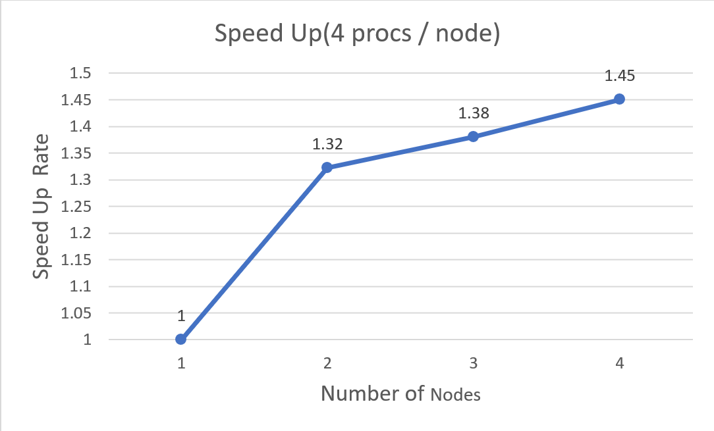
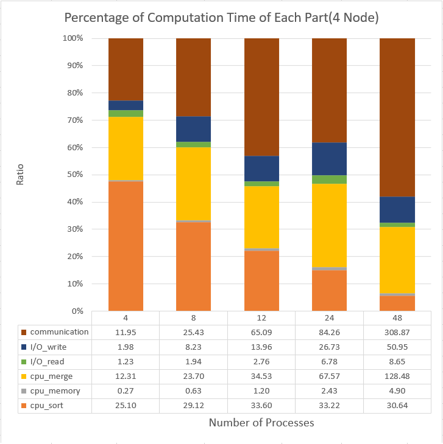

# Odd-Even Sort for MPI in C

# Implementation

Here is the [code](hw1.cc)

## The Sorting Algorithm
I use the  Spread Sort of Boost library for local sorting. The Spread Sort is a novel hybrid radix sort algorithm. The time complexity given by the Boost official documentation is min(N logN, N key_length)(Note: N is the length of the sequence to be sorted). 

As for Odd-Even Sort, I use Baudet-Stevenson Odd-Even sort. The Baudet-Stevenson sort transfers the whole segment that the processes have to another one each time which reduces the transfer time extremely. It guarantees that it can finish within n phase for n parallel processes. 

## Other Features

#### Parallel Read/Write: 
For each process, just read/write the segment that it needs to handle.

#### Non-Blocking Message Passing: 
I use Non-Blocking message pass operation to pass the segment to another. It means that for each process it  would send the segment it has to the target process without waiting.

# Performance

## Speed Up
The algorithm is faster than the sequential one in about 1.45 times at most.


## The Percentage of Each Part of Execution Time
3 Parts
1. CPU Execution Time = cpu_sort + cpu_merge + cpu_memory
2. I/O Execution Time = I/O_read + I/O_write
3. Communication Time



# Run The DEMO

You can clone this repo and check the followong commands

```
cd hw1
make
mpirun -np 4 ./hw1 11183 ./testcases/20.in ./hw1.out
```

<!-- Note: The SOTA version is under last_ver/no_stop.  -->